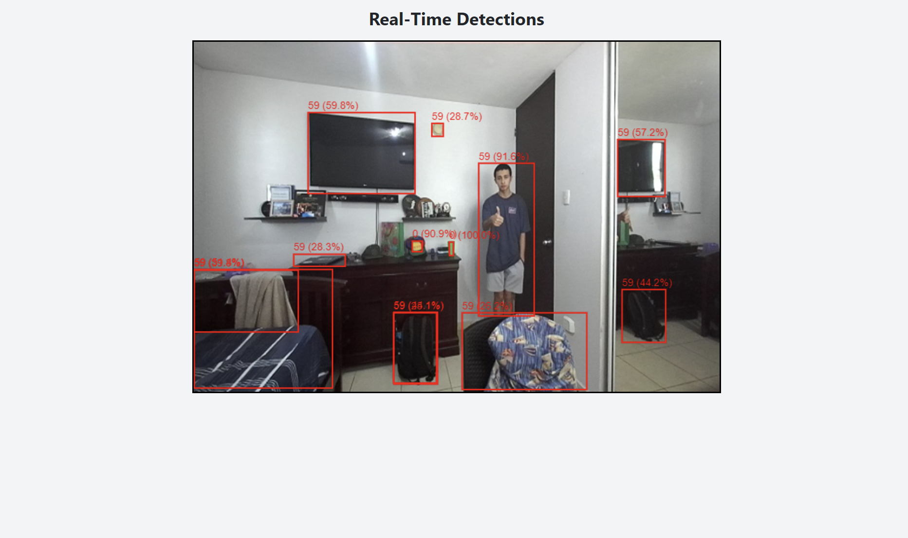

# Realtime Object Detection Visualization

This project is a FastAPI backend and React frontend that displays real-time object detections on a video feed using Server-Sent Events (SSE) and ROS for image processing.

## Features

- Live streaming of object detections via SSE
- Bounding boxes drawn on a canvas over a video feed
- Displays class and confidence score for each detected object
- Integrates with ROS to receive image data from `/zed2i/zed_node/rgb/image_rect_color`

## Requirements

### Backend (FastAPI & ROS)

- Python 3
- FastAPI
- ROS Noetic
- OpenCV (`cv2`)
- `cv_bridge` for converting ROS images
- `uvicorn` for running the server

### Frontend (React)

- A React app configured to connect to `http://localhost:8000`

## Installation

### Backend Setup

1. Ensure ROS is running and set up your environment:

   ```sh
   source /opt/ros/noetic/setup.bash
   ```

2. Start the FastAPI server:
   ```sh
   python3 API.py
   ```

### Frontend Setup

1. Navigate to your React project and install dependencies:
   ```sh
   npm install
   ```
2. Start the React development server:
   ```sh
   npm start
   ```

## Usage

Ensure the rosbag and the FastAPI server is running inside the docker container of Hydrus. Open 'http://127.0.0.1:8000/detections/stream' and 'http://127.0.0.1:8000/video_feed'

## API Overview

### Endpoints

- **`GET /video_feed`**: Provides a real-time video feed from the ROS image topic.
- **`GET /detections/stream`**: Streams real-time object detection data via SSE.

## Detections



## Troubleshooting

- **No detections appearing?** Ensure ROS is publishing images and `run_detection_pipelines()` is working.
- **Video feed not displaying?** Check `http://127.0.0.1:8000/video_feed`and `rosbag` is playing.
- **CORS issues?** Ensure FastAPI is allowing connections from `http://localhost:3000`.
